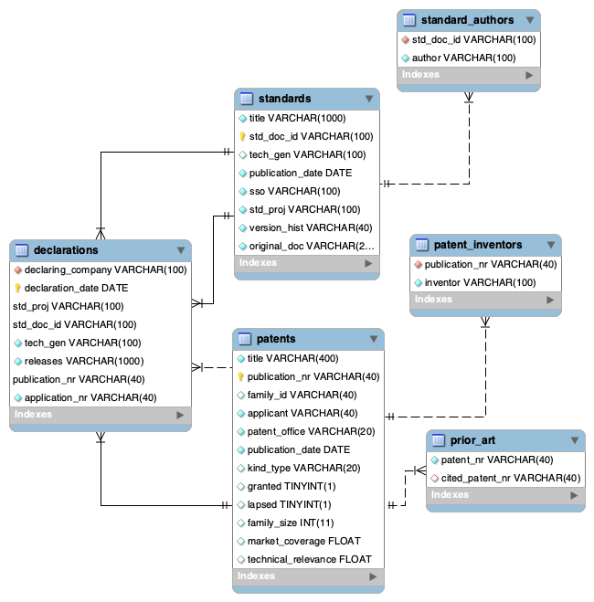

# Some Technical Notes:

## using docker's mysql image
For security purposes, you cannot connect to the mysql server from outside the container, so you need to grep the container logs for the generated password, then enter the container and change some security settings.

1. Change your `root` MySQL user password:
```
$docker exec -it mysql57 mysql -uname -p
p: (enter generated password)
mysql>ALTER USER 'root'@'localhost' IDENTIFIED BY 'password'
```
substitute `password` with something secure... You can avoid this step if you initialize your container via
```
$docker run --name mysql57 -p 3306:3306/tcp -e MYSQL_ROOT_PASSWORD=password -d mysql/mysql-server:5.7
```
(I'm booting MySQL v5.7 for compatibility purposes)

2. Change the connection settings so that `root` can be accessed from any IP:
```
mysql>UPDATE mysql.user SET host = '%' where user='root';
```
3. restart the docker image:
```
$docker restart mysql80
```
Provided you mapped your ports like:
```
$docker run -p 3306:3306/tcp --name=mysql80 -d mysql/mysql-server
```
you should now be able to connect via `'root'@localhost:3306`...

## DDL & python requirements:
You'll need the `mysql-connector-python` package to run the `python_ddl.py` script:
```
conda install -c anaconda mysql-connector-python
```
or `pip` should fetch it without too many issues.

The loading `.py` is named `python_ddl.py` and needs to sit in the same directory as
`dumps/`. Moreover, it is hardcoded to anticipate the existence of

* `dumps/patents.csv`
* `dumps/standards.csv`
* `dumps/declarations.csv`

and their original column names. This is because the database schema was inferred to have
the following entity-relationship diagram:



Some basic data exploration indicated that the `declarations.csv` data had a (minimal) primary key consisting of columns
```
standard_document_id standard_project publication_nr declaration_date
```

However, and more importantly: there were/are duplicate records in the `declarations.csv` data dump. I could've cleaned them in data pre-processing, but I decided to `INSERT` the data into a `try...except...` block and look for the `IntegrityError` exception to skip the insertion. This is predicated upon the idea that my `declarations` table has defined its primary key via
```
PRIMARY KEY (declaration date, std_doc_id, std_proj, publication_nr)
```
That there are duplicates in this extract is kind of confusing: surely the database that they came from would maintain its own integrity and make this impermissible?...

Note: this data includes Asian characters (Japanese?) and MySQL doesn't have true UTF-8 character support, so the database needs to be initialized with the `utf8mb4` character set:
```
CREATE DATABASE IF NOT EXISTS IPlytics CHARACTER SET utf8mb4;
```

Finally: the python script doesn't cover 100% best practice. In particular, it's not commented, nor does it contain as many `try...except...` blocks as it probably should. This was a half-deliberate decision. Time permitting, I'm not sure the operational context of such a script would demand the level of defensive-programming standard practices would dictate. Speaking plainly: I anticipate that scripts like this are meant to be one-off's, and the true guard-rails need to be baked into the daily/`chron`'d scripts that will be doing the brunt of the ETL work. As with all things, we need to measure the time-cost of making something like this "bullet-proof" versus the reality that it will only be used once and then thrown away. Good automation should always be considered as such:
```
(future developer time saved)/(time-cost to produce)
``` 
In an ideal world, we'd only work on projects where the ratios were estimated to be significantly greater than 1. In reality, we're often stuck polishing code beyond a reasonable marginal-utility rate and the ratio is abysmally low...

# Proof of correctness:

Here's the SQL to recreate `patents.csv`:
```
SELECT 
    pubs.*, cited_work
FROM
    (SELECT 
        patent_nr AS pub,
            GROUP_CONCAT(cited_patent_nr
                SEPARATOR ' | ') AS cited_work
    FROM iplytics.prior_art
    GROUP BY pub) AS citations
INNER JOIN
    (SELECT inventors, patents.*
    FROM patents
      INNER JOIN
    (SELECT 
        publication_nr AS pub,
            GROUP_CONCAT(inventor SEPARATOR ' | ') AS inventors
    FROM iplytics.patent_inventors
    GROUP BY publication_nr) AS inventors
      ON (patents.publication_nr = inventors.pub)) AS pubs
ON (pubs.publication_nr = citations.pub)
```

For `standards.csv`:
```
SELECT authors.authors, standards.*
FROM
    standards
INNER JOIN
    (SELECT std_doc_id, GROUP_CONCAT(author SEPARATOR ' | ') AS authors
     FROM standard_authors
     GROUP BY std_doc_id) AS authors
 ON (standards.std_doc_id = authors.std_doc_id);
 ```

 `declarations.csv` isn't built with any joins:
 ```
 SELECT * FROM declarations
 ```

# Analysis

## most cited patents:
```sql
select cited_patent_nr, count(patent_nr) as num_citations from prior_art
where cited_patent_nr <> ""
GROUP BY cited_patent_nr
order by num_citations desc
```

**Query result 9 rows!**

cited_patent_nr | num_citations
--- | ---
WO2014067166A1 | 4
WO2012093901A2 | 3
WO2012064093A2 | 3
WO2018127074A1 | 3
US8199719B2 | 3
US20180192404A1 | 2
US20160366720A1 | 2
US20130281096A1 | 2
KR2014009289A | 1

## downstream consequences of cited patents:
Say we wanted to investigated the most cited patents in the database, and understand what
their influence would be on future work. I.e., what would the average `technical_relevance` and `market_coverage` of a descendant patents look like. Moreover, how often is prior work
build upon solely by the a single applicant?

# Query result
```sql
SELECT 
    cited_patent_nr,
    COUNT(DISTINCT (publication_nr)) AS num_citations,
    AVG(technical_relevance) AS avg_tr,
    AVG(market_coverage) AS avg_mc,
    COUNT(DISTINCT (applicant)) AS num_unique_applicants,
    AVG(family_size) AS avg_family_size,
    AVG(granted) AS perc_granted,
    AVG(lapsed) AS perc_lapsed
FROM
    patents
        INNER JOIN
    (SELECT 
        cited_patent_nr, patent_nr
    FROM
        prior_art
    WHERE
        cited_patent_nr <> '') AS cited_patents ON (patents.publication_nr = cited_patents.patent_nr)
GROUP BY cited_patent_nr
ORDER BY cited_patent_nr DESC
```

**Query result 9 rows**

cited_patent_nr | num_citations | avg_tr | avg_mc | num_unique_applicants | avg_family_size | perc_granted | perc_lapsed
--- | --- | --- | --- | --- | --- | --- | ---
WO2018127074A1 | 3 | 0.7993568579355875 | 1.2580192188421886 | 2 | 5.6667 | 0.6667 | 0
WO2014067166A1 | 4 | 1.1488415598869324 | 1.1246584430336952 | 3 | 4.75 | 0.75 | 0
WO2012093901A2 | 3 | 0.9965272744496664 | 0.9434707462787628 | 3 | 3.6667 | 0.6667 | 0
WO2012064093A2 | 3 | 0.9965272744496664 | 0.9434707462787628 | 3 | 3.6667 | 0.6667 | 0
US8199719B2 | 3 | 0.9965272744496664 | 0.9434707462787628 | 3 | 3.6667 | 0.6667 | 0
US20180192404A1 | 2 | 0 | 1.0498121529817581 | 2 | 4.5 | 1 | 0
US20160366720A1 | 2 | 0 | 1.0498121529817581 | 2 | 4.5 | 1 | 0
US20130281096A1 | 2 | 0 | 1.0498121529817581 | 2 | 4.5 | 1 | 0
KR2014009289A | 1 | 0 | 1.704514980316162 | 1 | 8 | 1 | 0

It seems as if, for this small sample, none of the descendant patents lapsed, and only 25%
failed to get granted. Moreover, the most cited patent, `WO2014067166A1`, was used by
3 different applicants and had the second highest average TR.

## Future analysis
There are other patent questions probably worthy of analysis. For instance:

* what's the probability a patent gets granted when it doesn't cite prior work? Do more citations affect this probability?
* What's the relationship between associated standard and TR/MC?
* What's the managerial relevance of the metrics TR and MC? (Meaning: how do I, an external company, make money from a good understanding of them?)
